<div align="center">


# Digitalization, AI, and XAI: Strategies for the Transformation of the Healthcare Sector
### Complete Lecture Notebook Series · Spring 2026

**Prof. Dr. Utku Köse**
Süleyman Demirel University · Universidad Panamericana · University of North Dakota · VelTech University

*23 Jupyter notebooks · 6 modules · 20+ XAI methods · From glass-box models to fetal echocardiography*

</div>

---

## 📋 Table of Contents

- [About the Course](#-about-the-course)
- [Repository Structure](#-repository-structure)
- [Module Overview](#-module-overview)
  - [Module 1 — Foundations of Explainable AI in the Context of Digitalization in the Healthcare Sector](#module-1--foundations-of-explainable-ai-in-the-context-of-digitalization-in-the-healthcare-sector)
  - [Module 2 — Taxonomy and Evaluation of XAI Methods (NB0–NB7)](#module-2--taxonomy-and-evaluation-of-xai-methods-nb0--nb7)
  - [Module 3 — AI Architectures for Clinical Data Analysis (NB8–NB10)](#module-3--ai-architectures-for-clinical-data-analysis-nb8--nb10)
  - [Module 4 — Practical Application of XAI in Medical and IoMT Data (NB11–NB14)](#module-4--practical-application-of-xai-in-medical-and-iomt-data-nb11--nb14)
  - [Module 5 — Governance, Ethics, and Security in Medical AI Systems (NB15–NB17)](#module-5--governance-ethics-and-security-in-medical-ai-systems-nb15--nb17)
  - [Module 6 — Application Workshop: Design of an Explainable AI Solution (NB18–NB23)](#module-6--application-workshop-design-of-an-explainable-ai-solution-nb18--nb23)
- [Datasets Used](#-datasets-used)
- [Quick Start](#-quick-start)
- [Notebook Dependency Map](#-notebook-dependency-map)
- [Key Tools & Libraries](#-key-tools--libraries)
- [Sample Outputs](#-sample-outputs)
- [Citation](#-citation)
- [License](#-license)
- [Acknowledgements](#-acknowledgements)

---

## 🎓 About the Course

This repository contains the complete Jupyter notebook series for the graduate-level course **"Digitalization, AI, and XAI: Strategies for the Transformation of the Healthcare Sector"**, delivered at **Universidad Panamericana (Faculty of Business Sciences)**, Mexico City, Spring 2026. The course bridges the gap between state-of-the-art machine learning for clinical applications and the explainability requirements that make those systems trustworthy, auditable, and deployable in real healthcare settings.

The series spans **23 notebooks across 6 modules**, progressing from the fundamental tension between model performance and interpretability (Module 1) through to real-time IoMT streaming XAI, adversarial robustness, EU AI Act compliance, and capstone applications on drug repositioning, leukaemia genomics, and fetal echocardiography (Module 6).

### 📓 Notebooks as Lecture Notes

Each notebook is more than a coding exercise — it serves as a **self-contained lecture document**. Every notebook opens with theoretical background and motivation, walks through the mathematical or conceptual foundations of the methods being applied, and closes with a summary and curated academic references. Readers will find:

- **Inline lecture notes** written in Markdown cells before each section, explaining the theory behind each method before the code demonstrates it
- **Mathematical formulations** of key concepts (SHAP values, Shapley axioms, geodesic distances, fairness metrics, adversarial perturbation bounds, etc.)
- **Clinical interpretation guidance** — what the output means for a clinician, not just a data scientist
- **Discussion questions** at the end of major notebooks to encourage critical thinking
- **Paper recommendations** pointing to the primary literature behind each technique
- **Governance and regulatory context** (EU AI Act, FDA SaMD, GDPR Article 22) woven into the applied sections where relevant

The notebooks are designed so that a graduate student can read through them as lecture notes first and then run the code — or explore the executed outputs directly without running anything at all.

### 🔬 XAI Methods Covered

The course takes a deliberately broad and comparative approach to explainability, covering more than 20 distinct XAI methods across the model-agnostic, model-specific, local, global, tabular, image, and time-series domains:

| Category | Methods |
|----------|---------|
| **Intrinsically interpretable models** | Linear & Logistic Regression, LASSO, Decision Trees (CART), GAM, EBM, Cox Proportional Hazards, Integer Scoring Sheets, Fuzzy Rule-Based Systems |
| **Global feature attribution** | Permutation Feature Importance, PDP, ICE, ALE, SHAP (beeswarm, dependence, interaction), SAGE |
| **Local instance-level explanations** | LIME, MAPLE, Integrated Gradients, DeepSHAP, KernelSHAP |
| **Rule-based & contrastive** | Global Surrogate Trees, Anchors (IF-THEN rules), Counterfactual Explanations, DiCE diverse counterfactuals |
| **Visual / image XAI** | Grad-CAM, LRP (Layer-wise Relevance Propagation), Vanilla Saliency, SmoothGrad, Occlusion Sensitivity, Filter Activation Analysis, TCAV |
| **Time-series & streaming** | Windowed SHAP, Temporal Grad-CAM, Page-Hinkley SHAP drift detection |
| **Geometric / manifold XAI** | GEMEX (Geodesic Entropic Manifold Explainability) — geodesic sensitivity fields, holonomy networks, FAS, BTD |
| **Evaluation & robustness** | Faithfulness, Monotonicity, Completeness Error, Lipschitz Stability, Certified Robustness |

**What makes this course distinctive:**
- Every XAI technique is applied to **real or realistic clinical data** — not toy datasets
- Methods are always compared head-to-head so students understand when to use which tool
- Notebooks are fully self-contained and runnable on **Google Colab** (free tier), with all outputs already embedded so they can be read without execution
- Coverage extends to cutting-edge regulatory frameworks (EU AI Act 2024, FDA SaMD guidance)

---

## 📁 Repository Structure

```
📦 xai-healthcare-NB-lecture/
├── 📂 Module_1/                          # Foundations of Explainable AI in the Context of Digitalization in the Healthcare Sector
│   └── dl_clinical_lab_updated.ipynb     # Levelling session notebook (orig. Prof. Dr. Román Rodríguez Aguilar), updated
│
├── 📂 Module_2/                          # Taxonomy and Evaluation of XAI Methods (NB0–NB7)
│   ├── NB0_Setup_and_Dataset.ipynb
│   ├── NB1_Interpretable_AI_Glass_Box.ipynb
│   ├── NB2_Feature_Attribution_SHAP_PDP.ipynb
│   ├── NB3_Local_Explanations_LIME_MAPLE_IntGrad.ipynb
│   ├── NB4_Surrogate_Anchors_Counterfactuals.ipynb
│   ├── NB5_Visual_Saliency_Concept_Methods.ipynb
│   ├── NB6_GEMEX_Introduction_and_Comparison.ipynb
│   ├── NB7_XAI_Evaluation_Metrics.ipynb
│   ├── pima_diabetes.csv
│   ├── cleveland_heart.csv
│   └── pneumoniamnist_64.npz
│
├── 📂 Module_3/                          # AI Architectures for Clinical Data Analysis (NB8–NB10)
│   ├── NB8_Architecture_Comparison_EHR.ipynb
│   ├── NB9_CNN_Imaging_GradCAM.ipynb
│   └── NB10_TimeSeries_LSTM_Transformer.ipynb
│
├── 📂 Module_4/                          # Practical Application of XAI in Medical and IoMT Data (NB11–NB14)
│   ├── NB11_IoMT_Pipelines.ipynb
│   ├── NB12_AppleWatch_AFib.ipynb
│   ├── NB13_RealTime_Streaming_XAI.ipynb
│   └── NB14_BONUS_AppleWatch_LiveXAI.ipynb
│
├── 📂 Module_5/                          # Governance, Ethics, and Security in Medical AI Systems (NB15–NB17)
│   ├── NB15_Governance_Ethics_Audit.ipynb
│   ├── NB16_Adversarial_Attacks_Medical_AI.ipynb
│   └── NB17_XAI_Security_Defence.ipynb
│
├── 📂 Module_6/                          # Application Workshop: Design of an Explainable AI Solution (NB18–NB23)
│   ├── NB18_Adversarial_Attacks_PneumoniaMNIST.ipynb
│   ├── NB19_XAI_Defences_PneumoniaMNIST.ipynb
│   ├── NB20_Molecular_Property_Prediction_Drug_Repositioning_XAI.ipynb
│   ├── NB21_Leukaemia_GeneExpression_XAI.ipynb
│   ├── NB22_XAI_ToF_Echo.ipynb
│   ├── NB23_Streamlit_Dashboard.ipynb
│   └── app_nb23.py
│
└── 📂 docs/images/                       # Output figures referenced in this README
```

---

## 📚 Module Overview

---

### Module 1 — Foundations of Explainable AI in the Context of Digitalization in the Healthcare Sector

> *The foundational tension: neural networks achieve high accuracy but cannot explain themselves — and in clinical medicine, both are non-negotiable. This module establishes why XAI exists.*

| Notebook | Title | Open in Colab |
|----------|-------|--------------|
| [dl_clinical_lab_updated.ipynb](Module_1/dl_clinical_lab_updated.ipynb) | Deep Learning in Oncological Diagnosis | [](https://colab.research.google.com/github/utkukose/xai-healthcare-NB-lecture/blob/main/Module_1/dl_clinical_lab_updated.ipynb) |

**Origin:** This notebook is an updated and extended version of the original code introduced by **Prof. Dr. Román Rodríguez Aguilar** during the levelling session held before the start of the course. The levelling session provided students with the foundational practical context — a working clinical deep learning pipeline — that the rest of the course then unpacks and explains through XAI.

**Dataset:** Breast Cancer Wisconsin (Diagnostic) — 569 patients, 30 morphometric features extracted from Fine Needle Aspiration (FNA) biopsy images (tumour radius, texture, symmetry, concavity, and more).

This introductory notebook establishes the central problem the entire course is built around. Topics covered:

- **Clinical framing:** why False Negatives in oncology are more dangerous than False Positives, and how this shapes model evaluation strategy
- **Exploratory Data Analysis (EDA):** visualising feature distributions and class separation across benign/malignant cases
- **Preprocessing:** Z-score standardisation — why scale asymmetry distorts neural network training and how to correct it
- **DNN architecture and training:** a three-layer network (30 → 16 → 8 → 1) with Dropout regularisation and Early Stopping, with detailed explanation of each design choice; learning curves for diagnosing overfitting
- **Clinical evaluation metrics:** Precision, Recall (Sensitivity), Specificity, F1-score, ROC-AUC — derived from the confusion matrix with clinical interpretation of each
- **The Black Box confrontation:** identifying high-confidence wrong predictions and demonstrating why accuracy alone cannot justify clinical deployment
- **Interpretable baselines:** Logistic Regression (coefficient interpretation, odds ratios) and Decision Tree (step-by-step audit-trail rules) trained on the same data and compared against the DNN
- **The central trade-off:** a structured three-model comparison that sets up the XAI research question running through the rest of the course
- **Appendix — Interactive Playground:** hands-on experimentation with architecture hyperparameters

---

### Module 2 — Taxonomy and Evaluation of XAI Methods (NB0 – NB7)

> *A complete, methodical tour of the XAI landscape: from intrinsically interpretable models through global feature attribution, local explanations, visual saliency, contrastive and rule-based methods, geometric XAI, and rigorous evaluation metrics — applied throughout to real clinical data. By the end of this module, students can choose, apply, compare, and evaluate any major XAI method.*

| Notebook | Title | Open in Colab |
|----------|-------|--------------|
| [NB0](Module_2/NB0_Setup_and_Dataset.ipynb) | Setup & Dataset Foundation | [](https://colab.research.google.com/github/utkukose/xai-healthcare-NB-lecture/blob/main/Module_2/NB0_Setup_and_Dataset.ipynb) |
| [NB1](Module_2/NB1_Interpretable_AI_Glass_Box.ipynb) | Interpretable AI: Glass-Box Models | [](https://colab.research.google.com/github/utkukose/xai-healthcare-NB-lecture/blob/main/Module_2/NB1_Interpretable_AI_Glass_Box.ipynb) |
| [NB2](Module_2/NB2_Feature_Attribution_SHAP_PDP.ipynb) | Feature Attribution: SHAP & PDP | [](https://colab.research.google.com/github/utkukose/xai-healthcare-NB-lecture/blob/main/Module_2/NB2_Feature_Attribution_SHAP_PDP.ipynb) |
| [NB3](Module_2/NB3_Local_Explanations_LIME_MAPLE_IntGrad.ipynb) | Local Explanations: LIME, MAPLE & IntGrad | [](https://colab.research.google.com/github/utkukose/xai-healthcare-NB-lecture/blob/main/Module_2/NB3_Local_Explanations_LIME_MAPLE_IntGrad.ipynb) |
| [NB4](Module_2/NB4_Surrogate_Anchors_Counterfactuals.ipynb) | Surrogate Models, Anchors & Counterfactuals | [](https://colab.research.google.com/github/utkukose/xai-healthcare-NB-lecture/blob/main/Module_2/NB4_Surrogate_Anchors_Counterfactuals.ipynb) |
| [NB5](Module_2/NB5_Visual_Saliency_Concept_Methods.ipynb) | Visual Saliency & Concept Methods | [](https://colab.research.google.com/github/utkukose/xai-healthcare-NB-lecture/blob/main/Module_2/NB5_Visual_Saliency_Concept_Methods.ipynb) |
| [NB6](Module_2/NB6_GEMEX_Introduction_and_Comparison.ipynb) | GEMEX: Geodesic Entropic Manifold Explainability | [](https://colab.research.google.com/github/utkukose/xai-healthcare-NB-lecture/blob/main/Module_2/NB6_GEMEX_Introduction_and_Comparison.ipynb) |
| [NB7](Module_2/NB7_XAI_Evaluation_Metrics.ipynb) | XAI Evaluation Metrics | [](https://colab.research.google.com/github/utkukose/xai-healthcare-NB-lecture/blob/main/Module_2/NB7_XAI_Evaluation_Metrics.ipynb) |

#### NB0 — Setup & Dataset Foundation

One-time environment setup and introduction to the three core clinical datasets used throughout Modules 2–5. Covers package installation, import verification, dataset loading, exploratory statistics, class balance analysis, and a dataset complexity comparison to motivate the progression from simple tabular to real medical imaging data.

| Dataset | Type | Samples | Features | Used in |
|---------|------|---------|----------|---------|
| **Pima Diabetes** (A) | Tabular | 768 | 8 | NB1, NB2, NB4, NB6, NB8 |
| **Cleveland Heart Disease** (B) | Tabular | 297 | 13 | NB2, NB3, NB4, NB6, NB8 |
| **PneumoniaMNIST** (C) | Real chest X-rays (64×64) | 5,856 | — | NB5, NB9, NB18, NB19 |

Dataset C uses real de-identified paediatric chest X-rays from Guangzhou Women and Children's Medical Center (Kermany et al., 2018, *Cell*).

---

#### NB1 — Interpretable AI: Glass-Box Models

Route 1 of XAI: models where the explanation *is* the model itself — no post-hoc step needed. All sections use **Dataset A (Pima Diabetes)**. Topics covered:

- **Lecture notes:** the taxonomy of XAI routes (Route 1: glass-box, Route 2: post-hoc); when intrinsic interpretability is sufficient and when it is not
- **Linear Regression:** coefficient interpretation, β-weight magnitudes, directional meaning, confidence intervals on clinical predictors
- **Logistic Regression:** log-odds, odds ratios, Wald test significance, clinical communication of coefficients
- **LASSO Regularisation:** L1 penalty as automatic feature selection; sparsity path and λ tuning; which diabetes risk factors survive regularisation
- **Decision Tree (CART):** Gini impurity, information gain, pruning; generating human-readable audit trails for individual predictions
- **Generalised Additive Models (GAM):** shape functions for each feature; non-linear but transparent relationships between predictors and outcome
- **Explainable Boosting Machine (EBM):** pairwise interaction terms; comparing EBM shape functions against GAM on the same data
- **Cox Proportional Hazards:** survival analysis applied to diabetes time-to-event data; hazard ratios and their clinical interpretation
- **Integer Scoring Sheet:** translating logistic regression coefficients into a point-based clinical scoring system (SCORE-style); bedside usability
- **Fuzzy Rule-Based Systems:** linguistic IF-THEN rules; membership functions; fuzzy inference pipeline; comparison against crisp decision trees
- **Summary:** side-by-side comparison of all nine methods on accuracy, interpretability, and clinical communication suitability

---

#### NB2 — Feature Attribution: SHAP & PDP

Route 2 of XAI: post-hoc global and local feature attribution methods. This notebook uses **both Dataset A and Dataset B**, explicitly switching between them mid-notebook to demonstrate how attribution patterns differ across clinical problems. Topics covered:

- **Lecture notes:** the SHAP Shapley value formula (full mathematical derivation); the difference between global and local attribution; why permutation importance is a weaker alternative
- **Permutation Feature Importance:** model-agnostic global ranking; variance in importance across re-permutations; comparison to coefficient magnitudes from NB1
- **Partial Dependence Plots (PDP):** marginalisation over the data distribution; how to read PDP slopes and plateaux in clinical terms
- **ICE Plots (Individual Conditional Expectation):** per-patient PDP curves; detecting interaction effects hidden in the global PDP mean; clinical heterogeneity revealed
- **ALE Plots (Accumulated Local Effects):** correcting for feature correlation bias in PDP; when ALE and PDP disagree and what it means
- **Dataset switch to B (Heart Disease) for SHAP sections**
- **SHAP Global Beeswarm Summary:** TreeSHAP on GBM; reading beeswarm colour, spread, and ordering; which heart disease features drive risk most
- **SHAP Local Waterfall Plot:** explaining individual patient predictions; the baseline → prediction decomposition
- **SHAP Dependence & Interaction Plots:** feature-specific SHAP values vs feature magnitude; coloured interaction terms; clinical interpretation of non-linear effects
- **SAGE (Shapley Additive Global importancE):** global performance attribution vs local SHAP; when SAGE ranks differ from SHAP and why
- **Summary:** mapping each method to clinical communication use cases

<p align="center">
  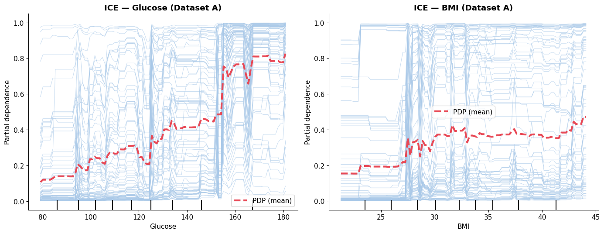<br>
  <em>NB2 — ICE curves (individual patients, blue) and the PDP mean (red dashed) for Glucose and BMI on the Pima Diabetes dataset. The sharp PDP step near Glucose=155 reveals a clinically meaningful decision threshold.</em>
</p> — Local Explanations: LIME, MAPLE & Integrated Gradients

Instance-level explanations for individual patient predictions — critical for clinical decision support. All sections use **Dataset B (Heart Disease)**. Topics covered:

- **Lecture notes:** the local fidelity problem; why global methods cannot explain individual decisions; the instability challenge in local XAI
- **LIME:** local linear surrogate model; neighbourhood sampling strategy; kernel width selection; reading a LIME bar chart for a single patient
- **LIME Stability Test ⚠️:** running LIME multiple times on the same patient and measuring explanation variance; demonstrating that LIME is non-deterministic and why this matters in clinical settings where reproducibility is required
- **MAPLE:** Model Agnostic Prediction Local Explanations via random forest local expert selection; comparison to LIME on the same patients
- **Integrated Gradients on Neural Network:** path integral from baseline to input along the feature axis; attribution axioms (completeness, sensitivity, implementation invariance); applied to an MLP trained on heart disease
- **DeepSHAP & KernelSHAP:** SHAP explainer variants for neural networks and arbitrary models; when to prefer each over standard TreeSHAP
- **Head-to-head comparison:** SHAP vs LIME vs MAPLE on ten heart disease patients; agreement matrix; cases where methods disagree and clinical implications of those disagreements

---

#### NB4 — Surrogate Models, Anchors & Counterfactuals

Rule-based and contrastive explanations — the forms of XAI most aligned with how clinicians naturally reason about decisions. Uses **both Datasets A and B**. Topics covered:

- **Lecture notes:** the counterfactual optimisation problem (Wachter et al. 2017 formulation with full loss function); why rule-based explanations satisfy legal auditability requirements; the difference between descriptive rules and actionable rules
- **Global Surrogate Decision Tree:** training a decision tree to approximate a black-box GBM; fidelity score (R²); reading surrogate rules as approximate global explanations; limitations of surrogate fidelity
- **Anchors (IF-THEN Rules):** high-precision rules that apply to a local neighbourhood of the input; coverage vs precision trade-off; comparing anchor rules across demographically different patients
- **Counterfactual Explanations:** minimum-change counterfactuals using the Wachter et al. optimisation; actionability constraints (only modifiable features); clinical reading of "what would need to change for a different outcome"
- **DiCE Diverse Counterfactuals:** generating multiple diverse counterfactuals per patient; trade-off between diversity and proximity; clinical value of presenting multiple pathways
- **Clinical Communication Exercise — Three-Audience Adaptation:** taking the same model prediction and adapting the explanation for (1) the patient in plain language, (2) a nursing practitioner, and (3) a specialist cardiologist — each requiring a different level of technical detail
- **Cross-Dataset Comparison:** applying all four methods to both Dataset A (diabetes) and Dataset B (heart disease) side by side; discussing why surrogate fidelity and anchor precision differ across clinical domains
- **Final Discussion Questions:** structured prompts for classroom or self-study critical reflection

---

#### NB5 — Visual Saliency & Concept Methods

XAI for medical imaging — applied end-to-end to real PneumoniaMNIST chest X-rays (**Dataset C**). The key pedagogical shift: all prior notebooks used tabular data where the "right answer" for an explanation is debatable. Real images allow clinical validation of whether a method highlights the correct anatomical region. Topics covered:

- **Lecture notes:** why real images matter for XAI validation (synthetic images make every method look plausible); Dataset C provenance; the seven visual XAI methods covered and when each applies
- **CNN Architecture & Training:** a lightweight custom CNN trained on real chest X-rays; training curves; evaluation on the held-out test set; per-class precision and recall
- **Grad-CAM (Gradient-weighted Class Activation Mapping):** gradient of the class score w.r.t. the last convolutional feature map; clinical reading of heat map location; correct vs incorrect cases
- **LRP (Layer-wise Relevance Propagation):** backward propagation of relevance scores through each layer; pixel-level attribution; comparison to Grad-CAM spatial resolution
- **Vanilla Saliency & SmoothGrad:** input gradient magnitude as attribution; noise problem in vanilla saliency; SmoothGrad averaging over N=40 noisy copies to reduce attribution noise
- **Occlusion Sensitivity:** systematically masking image patches and measuring prediction change; coarser but more interpretable spatial attribution
- **Filter Activation Analysis:** visualising which learned filters fire on pneumonia vs normal X-rays; connecting low-level texture detectors to high-level clinical features
- **TCAV (Testing with Concept Activation Vectors):** training linear probes on human-defined concepts (opacity, consolidation); testing whether the CNN has learned clinically meaningful intermediate representations
- **Integration — All Methods on One Clinical Case:** applying all seven methods to a single pneumonia X-ray and comparing their outputs side by side; clinical audit checklist
- **Normal vs Pneumonia Comparative XAI Audit:** systematic comparison of all methods across confirmed normal and confirmed pneumonia cases; safety audit on misclassified X-rays (true class vs predicted class attention divergence)
- **Summary and Discussion Questions:** key differences between real and synthetic image XAI; cross-notebook synthesis of Routes 1 and 2

<p align="center">
  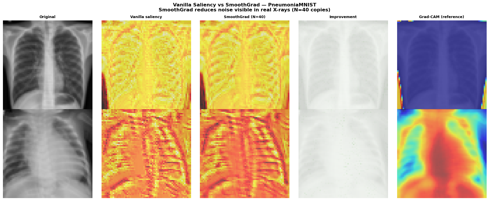<br>
  <em>NB5 — Vanilla Saliency vs SmoothGrad on real chest X-rays (Normal top, Pneumonia bottom). SmoothGrad reduces attribution noise substantially; Grad-CAM (right) localises the opacified lung regions relevant to pneumonia classification.</em>
</p>

<p align="center">
  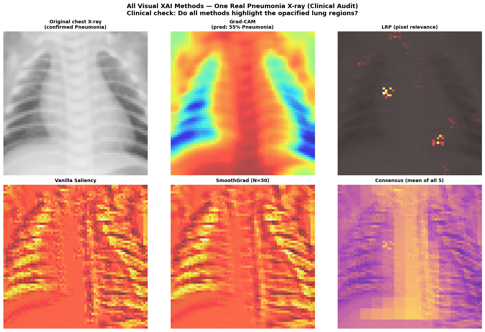<br>
  <em>NB5 — Grad-CAM safety audit on misclassified X-rays. Blue = attention toward the true class; Red = attention toward the predicted (wrong) class. The |ΔCAM| map reveals where the model's focus diverges from the correct clinical region — a critical tool for clinical validation before deployment.</em>
</p> — GEMEX: Geodesic Entropic Manifold Explainability

NB6 introduces GEMEX, one of the more advanced XAI methods in the course and a research contribution of the course instructor. GEMEX is grounded in Riemannian information geometry: rather than assigning scalar feature scores (as SHAP and LIME do), it operates on the statistical manifold of model distributions, making it reparameterisation-invariant and capable of capturing geometric structure — feature interaction holonomy, curvature fields, and geodesic attention sequences — that standard attribution methods cannot represent.

NB6 is positioned after NB1–NB5 intentionally: students who have already worked with SHAP, LIME, MAPLE, Grad-CAM, and counterfactuals are well-placed to appreciate what GEMEX adds and where its perspective differs from those established methods.

Topics covered:

- **The Fundamental Fallacy:** all classical XAI methods assume Euclidean straight-line paths from a baseline to the query point; why this is coordinate-dependent and fails on curved statistical manifolds; intuitive and mathematical illustration
- **GEMEX geometric foundations:** Fisher Information Matrix (FIM) as the Riemannian metric; geodesic path integration; Geodesic Sensitivity Field (GSF); PTI holonomy capturing pairwise feature transport interactions; Ricci scalar curvature as a local model complexity indicator; Flat Approximation Score (FAS) and Bhattacharyya-Tangent Distance (BTD)
- **Dataset and models:** Cleveland Heart Disease (B); four model types (GBM, SVM, MLP, Logistic Regression) trained on the same data for cross-model comparison
- **SHAP (TreeSHAP):** reproduced for direct comparison — same dataset, same patients
- **LIME:** reproduced for direct comparison
- **MAPLE:** reproduced for direct comparison
- **GEMEX:** full geodesic attribution pipeline applied to the same patients as SHAP/LIME/MAPLE
- **Four-Method Side-by-Side Comparison:** where do SHAP, LIME, MAPLE, and GEMEX agree? Where do they disagree? What does disagreement mean clinically?
- **GEMEX Across Four Model Types:** why GEMEX attributions change with model architecture in a geometrically meaningful way that scalar methods miss
- **GEMEX Exclusive Capabilities:** Feature Attention Sequence (FAS) showing which feature dominates at each geodesic step; Holonomy Network showing pairwise feature interaction geometry; curvature fields
- **Cross-Domain Validation:** GEMEX applied to Dataset A (Pima Diabetes) for comparison
- **References and playground:** `pip install gemex` · [GitHub](https://github.com/utkukose/gemex) · interactive playground at `utkukose.github.io/gemex_playground/`

<p align="center">
  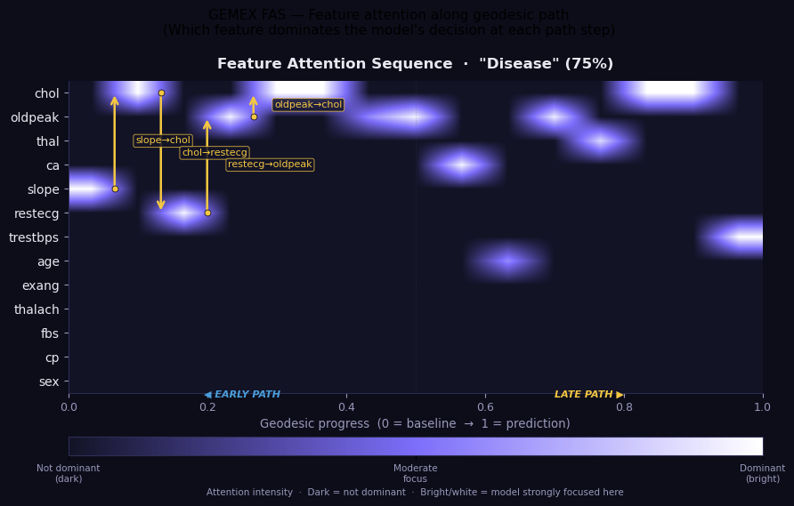<br>
  <em>NB6 — GEMEX Feature Attention Sequence (FAS): which feature dominates the model's decision at each step along the geodesic from baseline to prediction. The sequential shift (slope → chol → oldpeak) is a form of attribution dynamics invisible to scalar methods like SHAP or LIME.</em>
</p>

<p align="center">
  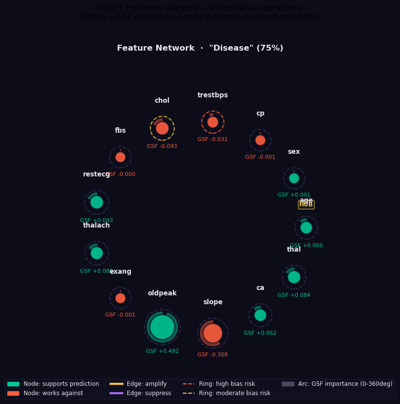<br>
  <em>NB6 — GEMEX Holonomy Network: nodes show Geodesic Sensitivity Field (GSF) attribution; edges encode parallel transport holonomy between feature pairs. This reveals non-linear feature interaction geometry that scalar attribution methods cannot capture.</em>
</p> — XAI Evaluation Metrics

Going beyond visual inspection: rigorous quantitative evaluation of explanation quality. Previous notebooks demonstrated *what* each method explains and *how* explanations differ; this notebook answers *which method is most trustworthy and why*. Uses **both Datasets A and B**, same MLP architecture throughout for direct comparability. Topics covered:

- **Objective and motivation:** why visual plausibility is insufficient; the four properties a trustworthy explanation must satisfy; literature survey of evaluation frameworks
- **Metric 1 — Faithfulness (Spearman ρ):** removing top-attributed features should most degrade model performance; implementation as a feature-removal degradation curve; interpretation of the Spearman correlation between attribution rank and degradation
- **Metric 2 — Monotonicity:** adding features in order of decreasing attribution should monotonically increase model confidence; measuring the fraction of patients where this holds
- **Metric 3 — Completeness Error:** the sum of all attributions should equal the prediction minus the baseline; how far each method deviates from this axiom
- **Metric 4 — Stability (Lipschitz Ratio):** similar inputs should receive similar explanations; measuring the worst-case ratio of explanation change to input change across test patients
- **Full benchmark:** N=50 test patients per dataset; all four metrics for SHAP, LIME, MAPLE, and GEMEX; results stored in a structured results dictionary
- **Visualisation:** box plots of all four metrics across methods and both datasets; which method wins on which metric and for which dataset
- **Summary table with references:** connecting each metric to its original paper; honest discussion of GEMEX evaluation caveats (the metrics were developed in a Euclidean framework and require careful interpretation for Riemannian methods)

<p align="center">
  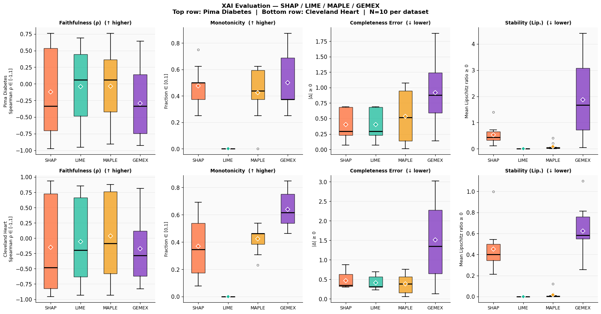<br>
  <em>NB7 — Full XAI evaluation benchmark (N=50 test patients per dataset). Box plots show the distribution of each metric across patients for SHAP, LIME, MAPLE, and GEMEX on both Pima Diabetes (top) and Cleveland Heart Disease (bottom).</em>
</p>

---

### Module 3 — AI Architectures for Clinical Data Analysis (NB8 – NB10)

> *Architecture choice is not independent of explainability — the wrong model makes good XAI impossible. This module covers architectures for tabular EHR data, medical imaging, and clinical time series, always asking: which XAI method is faithful for this model type?*

| Notebook | Title | Open in Colab |
|----------|-------|--------------|
| [NB8](Module_3/NB8_Architecture_Comparison_EHR.ipynb) | Architecture Comparison: EHR & Tabular Data | [](https://colab.research.google.com/github/utkukose/xai-healthcare-NB-lecture/blob/main/Module_3/NB8_Architecture_Comparison_EHR.ipynb) |
| [NB9](Module_3/NB9_CNN_Imaging_GradCAM.ipynb) | CNN Architectures & Grad-CAM on Chest X-Rays | [](https://colab.research.google.com/github/utkukose/xai-healthcare-NB-lecture/blob/main/Module_3/NB9_CNN_Imaging_GradCAM.ipynb) |
| [NB10](Module_3/NB10_TimeSeries_LSTM_Transformer.ipynb) | Time-Series: LSTM, GRU & Transformers | [](https://colab.research.google.com/github/utkukose/xai-healthcare-NB-lecture/blob/main/Module_3/NB10_TimeSeries_LSTM_Transformer.ipynb) |

**NB8 — Architecture Comparison: EHR & Tabular Data** · [](https://colab.research.google.com/github/utkukose/xai-healthcare-NB-lecture/blob/main/Module_3/NB8_Architecture_Comparison_EHR.ipynb)

The central thesis of this notebook: architecture choice and XAI method selection are not independent decisions. Choosing the wrong architecture makes faithful XAI impossible. Topics covered:

- **Clinical decision map for architecture selection:** a visual taxonomy guiding the choice between LR, RF, GBM, SVM, and MLP based on interpretability requirements, data volume, and regulatory context
- **The three IoMT pipeline challenges not covered in Module 2:** structured missingness in EHR data, feature engineering for temporal records, computational budget constraints
- **Parameter sweep experiments:** controlled sweeps of tree depth, number of estimators, regularisation strength, and hidden layer width — seeing how accuracy and explanation quality co-vary
- **Model-matched SHAP:** TreeSHAP for GBM/RF (exact, polynomial-time), LinearSHAP for LR, KernelSHAP for SVM and MLP — why using the wrong SHAP explainer for a model type produces unreliable attributions
- **Faithfulness scoring:** computing Monotonicity and Sufficiency scores for each model/explainer combination; demonstrating empirically that architecture–XAI mismatch degrades faithfulness even when accuracy is unchanged
- **AI–Clinician interaction formats:** the same model prediction presented differently for (1) patient self-service, (2) nursing workflow, (3) specialist consultation — each format validated against Tonekaboni et al. (2019) interface principles
- **Paper recommendations** with concise annotations for further reading

---

**NB9 — CNN Architectures & Grad-CAM on Chest X-Rays** · [](https://colab.research.google.com/github/utkukose/xai-healthcare-NB-lecture/blob/main/Module_3/NB9_CNN_Imaging_GradCAM.ipynb)

Topics covered:

- **Data visualisation:** examining the chest X-ray patterns that distinguish pneumonia from normal — what a clinician looks for and whether the CNN learns the same features
- **Custom CNN architecture:** training and evaluating a lightweight custom CNN and a ResNet-inspired architecture on PneumoniaMNIST; training curves and per-class metrics
- **Architecture parameter sweep:** controlled experiments varying filter count (16, 32, 64), kernel size (3×3, 5×5, 7×7), and network depth (2, 3, 4 convolutional blocks) — measuring the joint effect on accuracy and explanation quality
- **Grad-CAM from scratch:** full implementation of Selvaraju et al. (2017) without relying on a library — understanding the gradient hook mechanism, the global average pooling step, and the upsampling procedure
- **Layer-by-layer Grad-CAM:** applying Grad-CAM at every convolutional layer in the network and observing how spatial attention evolves from low-level edge detection (early layers) to high-level semantic regions (late layers) — the critical clinical validation experiment
- **Key clinical rule demonstrated empirically:** a CNN whose Grad-CAM attention does not align with clinically expected regions (lungs, not background) must not be deployed regardless of its accuracy score
- **Paper recommendations** for the CNN XAI literature

---

**NB10 — Time-Series: LSTM, GRU & Transformers** · [](https://colab.research.google.com/github/utkukose/xai-healthcare-NB-lecture/blob/main/Module_3/NB10_TimeSeries_LSTM_Transformer.ipynb)

Topics covered:

- **Synthetic ICU time series generation:** physiologically realistic vital sign trajectories (HR, BP, SpO₂, RR, temperature) with injected sepsis-pattern deterioration; why synthetic data is used here (no open MIMIC-III access required) and how the physiological realism is validated
- **LSTM mathematical background:** cell state, forget gate, input gate, output gate — full equations presented and explained in terms of what clinical information each gate retains or discards
- **Architecture comparison:** LSTM vs Bi-LSTM vs GRU vs a minimal clinical Transformer (encoder-only, 2 heads, 2 layers) on the sepsis early warning task; training efficiency and AUC comparison
- **Attention is NOT Explanation — empirical demonstration:** reproducing the key finding of Jain & Wallace (2019); showing that attention weights are not faithful explanations of model decisions; attention distributions that change without changing the output
- **Windowed SHAP as the faithful alternative:** extracting statistical features from sliding time windows (mean, std, slope, min, max per channel) and applying TreeSHAP; interpreting which time window and which physiological channel drives the sepsis alert
- **Paper recommendations** for the temporal XAI and attention-as-explanation literature

---

### Module 4 — Practical Application of XAI in Medical and IoMT Data (NB11 – NB14)

> *Moving from the lab to the clinic: this module applies the full XAI toolkit to real IoMT pipelines — continuous glucose monitors, ICU bedside monitors, wearable ECGs, and Apple Watch health streams — confronting the challenges of device heterogeneity, concept drift, and real-time latency that lab experiments cannot simulate.*

| Notebook | Title | Open in Colab |
|----------|-------|--------------|
| [NB11](Module_4/NB11_IoMT_Pipelines.ipynb) | IoMT Pipelines: Three Clinical Scenarios | [](https://colab.research.google.com/github/utkukose/xai-healthcare-NB-lecture/blob/main/Module_4/NB11_IoMT_Pipelines.ipynb) |
| [NB12](Module_4/NB12_AppleWatch_AFib.ipynb) | Apple Watch AFib Detection | [](https://colab.research.google.com/github/utkukose/xai-healthcare-NB-lecture/blob/main/Module_4/NB12_AppleWatch_AFib.ipynb) |
| [NB13](Module_4/NB13_RealTime_Streaming_XAI.ipynb) | Real-Time Streaming XAI | [](https://colab.research.google.com/github/utkukose/xai-healthcare-NB-lecture/blob/main/Module_4/NB13_RealTime_Streaming_XAI.ipynb) |
| [NB14](Module_4/NB14_BONUS_AppleWatch_LiveXAI.ipynb) | BONUS: Apple Watch Live XAI | [](https://colab.research.google.com/github/utkukose/xai-healthcare-NB-lecture/blob/main/Module_4/NB14_BONUS_AppleWatch_LiveXAI.ipynb) |

**NB11 — IoMT Pipelines: Three Clinical Scenarios** · [](https://colab.research.google.com/github/utkukose/xai-healthcare-NB-lecture/blob/main/Module_4/NB11_IoMT_Pipelines.ipynb)

Three end-to-end IoMT XAI pipelines, each covering the full path from raw sensor data to explainable clinical alert. Topics covered:

- **IoMT Device Taxonomy:** classifying devices by data modality, sampling rate, and FDA/EU MDR regulatory class — a prerequisite decision framework for any IoMT AI project
- **Three additional IoMT pipeline challenges** bridging from Module 3: structured missingness (IoMT gaps are not random — Apple Watch charging gaps occur at predictable times and require different handling than missing clinical data), sensor drift and calibration, real-time latency budget
- **Pipeline 1 — CGM Glucose / Hypoglycaemia Prediction:** CGM data at 5-minute intervals; 30-minute ahead prediction of glucose < 70 mg/dL; windowed SHAP showing which glucose trend features drive each alert; reference: Danne et al. (2017) International Consensus on Use of CGM
- **Pipeline 2 — ICU Bedside Monitor / Sepsis-3 Early Warning:** Sepsis-3 criteria (SOFA + qSOFA); multi-channel vital sign feature engineering; windowed SHAP + LIME on the same patients for direct comparison; reference: Seymour et al. (2016) JAMA; MIMIC-III schema context
- **Pipeline 3 — Wearable ECG / AFib Detection:** 1D-CNN on windowed ECG segments; Temporal Grad-CAM showing which ECG timesteps drive the AFib classification; reference: Hannun et al. (2019) Nature Medicine
- **Cross-Pipeline XAI Comparison:** performance (AUC), inference latency (ms), and faithfulness (monotonicity score) compared across all three pipelines; when to prefer SHAP vs LIME vs Grad-CAM based on data modality
- **Model Card Generator:** automated FDA SaMD documentation produced from model metadata; reference: FDA 2021 AI/ML SaMD Action Plan; Mitchell et al. (2019) Model Cards

---

**NB12 — Apple Watch AFib Detection** · [](https://colab.research.google.com/github/utkukose/xai-healthcare-NB-lecture/blob/main/Module_4/NB12_AppleWatch_AFib.ipynb)

End-to-end from raw Apple HealthKit XML to a four-panel clinical XAI dashboard. Topics covered:

- **Apple HealthKit data model:** the five XML element types; HKQuantityTypeIdentifier schema; source deduplication logic; the six quantity types used (HR, HRV SDNN, SpO₂, respiratory rate, step count, walking heart rate average)
- **The three HealthKit gap types:** charging gaps (60–90 min/day, predictable), low-activity periods, and true sensor unavailability — why each requires a different imputation strategy
- **Synthetic HealthKit XML generation:** structurally identical to a real Apple Health export; students with an Apple Watch can replace this with their own `export.xml` without changing any code
- **Zero-dependency XML parsing:** complete parser using Python's standard library `xml.etree.ElementTree` only; gap classification; sliding-window feature engineering (mean, std, min, max, irregularity per sensor per 30-minute window)
- **GBM classifier + windowed SHAP at scale:** training across a synthetic patient cohort; per-patient SHAP waterfall generation and interpretation
- **Four-panel clinical XAI dashboard:** (1) AFib risk timeline with alert thresholds, (2) Heart Rate & HRV SDNN sensor streams, (3) SHAP waterfall for the latest reading with primary driver identified, (4) current risk alert with clinical recommendation — designed per Tonekaboni et al. (2019)
- **Real Apple Watch data guide:** step-by-step export instructions; privacy considerations; expected differences between synthetic and real data; the parser works on real exports unchanged

---

**NB13 — Real-Time Streaming XAI** · [](https://colab.research.google.com/github/utkukose/xai-healthcare-NB-lecture/blob/main/Module_4/NB13_RealTime_Streaming_XAI.ipynb)

Topics covered:

- **Streaming IoMT data simulator:** physiologically realistic vital signs emitted at configurable rates; three concept drift scenarios injected at known timesteps: (1) sudden firmware update shifting HR readings, (2) gradual seasonal baseline drift, (3) recurrent periodic drift
- **Concept drift in IoMT:** the three clinical mechanisms causing drift; why SHAP distribution monitoring detects drift earlier than AUC monitoring (three-stage sequence: feature distribution changes → SHAP changes → AUC drops)
- **Real-time inference engine:** GBM + exact TreeSHAP within the sub-100ms clinical latency budget; rolling window implementation; measured latency benchmarks
- **Live animated XAI dashboard:** all panels (risk score, SHAP bar chart, top features, clinical alert) updating in real time on each new patient window
- **Page-Hinkley test on SHAP distributions:** full mathematical derivation (sequential change-point detection, Page 1954); SHAP distributions as the optimal drift signal; parametrisation guide for healthcare IoMT applications
- **Production monitoring — Four Signal Dashboard:** rolling prediction distribution · rolling mean SHAP magnitude · rolling AUC · HIGH-alert rate as clinical workload proxy; aligned with FDA SaMD Real-World Performance requirements
- **FDA PCCP governance report generator:** Predetermined Change Control Plan documentation template; Real-World Performance monitoring framework
- **Module 4 synthesis:** the three critical lessons across NB11–NB13; complete notebook dependency map

<p align="center">
  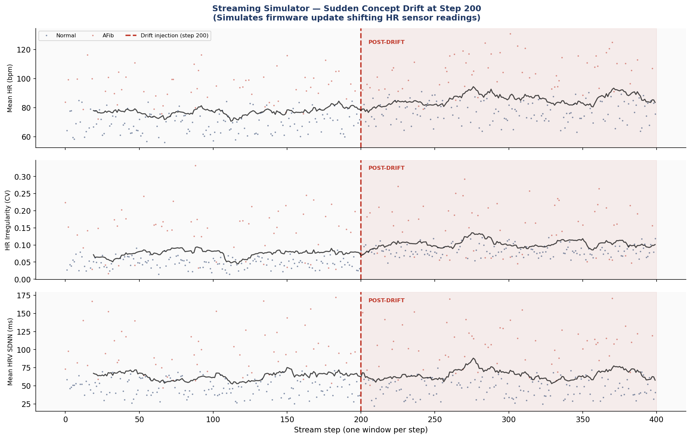<br>
  <em>NB13 — Streaming simulator: sudden concept drift injected at step 200 (simulating a firmware update shifting HR sensor readings). Three physiological channels show clear distributional shift in the post-drift region.</em>
</p>

<p align="center">
  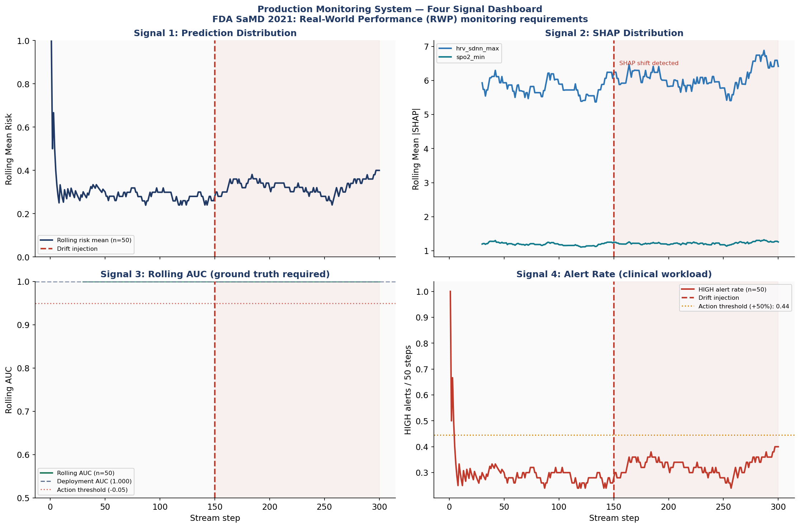<br>
  <em>NB13 — Production monitoring system (FDA SaMD Real-World Performance requirements): rolling risk mean, SHAP distribution with detected shift, rolling AUC, and HIGH-alert rate — all updating in real time.</em>
</p>

---

**NB14 — BONUS: Apple Watch Live XAI** · [](https://colab.research.google.com/github/utkukose/xai-healthcare-NB-lecture/blob/main/Module_4/NB14_BONUS_AppleWatch_LiveXAI.ipynb)

Topics covered:

- **System architecture:** Apple Watch → Bluetooth → iPhone Health app → Shortcuts automation → HTTP POST → Flask receiver → GBM + SHAP inference → live dashboard; no app installation required on the phone
- **AFib risk model training:** same GBM pipeline as NB11/NB12; can be retrained on accumulated real readings
- **Flask receiver server:** background-threaded HTTP POST endpoint; data validation and rolling window buffer; runs within a Jupyter cell
- **iPhone Shortcuts setup — step-by-step (5 minutes, no iOS coding):** reading HR, HRV, SpO₂, respiratory rate, and step count from HealthKit and POSTing to the laptop; automation scheduling; full troubleshooting guide; Turkish iOS references (Kestirmeler app)
- **Test data injection:** synthetic readings sent to the Flask server to verify the full pipeline before real Watch data arrives
- **Live XAI dashboard:** polls every 3 seconds; redraws risk timeline, sensor streams, SHAP waterfall, and alert panel on each update
- **GEMEX comparison on real Apple Watch data:** geodesic arc-length attribution on the same readings, compared to SHAP waterfall
- **Important caveats:** educational demonstration only; model trained on synthetic data; not a validated medical device

<p align="center">
  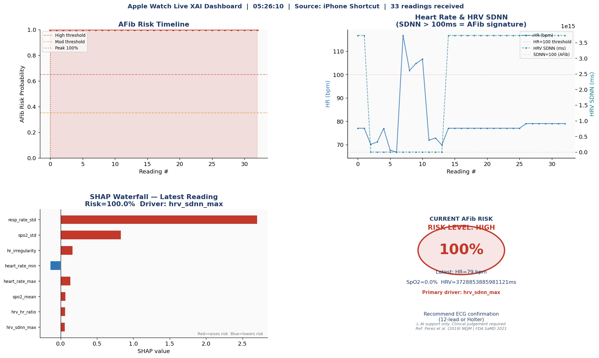<br>
  <em>NB14 — Apple Watch Live XAI Dashboard receiving real data via iPhone Shortcut. Risk timeline (top left), Heart Rate & HRV SDNN streams (top right), SHAP Waterfall for the latest reading with primary driver (bottom left), and risk alert with clinical recommendation (bottom right).</em>
</p>

---

### Module 5 — Governance, Ethics, and Security in Medical AI Systems (NB15 – NB17)

> *Explainability without fairness is incomplete. Fairness without robustness is fragile. This module covers the full compliance and security stack: EU AI Act classification, subgroup bias auditing, adversarial attacks on clinical AI, and XAI-based defence.*

| Notebook | Title | Open in Colab |
|----------|-------|--------------|
| [NB15](Module_5/NB15_Governance_Ethics_Audit.ipynb) | Governance, Ethics & Bias Audit | [](https://colab.research.google.com/github/utkukose/xai-healthcare-NB-lecture/blob/main/Module_5/NB15_Governance_Ethics_Audit.ipynb) |
| [NB16](Module_5/NB16_Adversarial_Attacks_Medical_AI.ipynb) | Adversarial Attacks on Medical AI | [](https://colab.research.google.com/github/utkukose/xai-healthcare-NB-lecture/blob/main/Module_5/NB16_Adversarial_Attacks_Medical_AI.ipynb) |
| [NB17](Module_5/NB17_XAI_Security_Defence.ipynb) | XAI-Based Security & Defence | [](https://colab.research.google.com/github/utkukose/xai-healthcare-NB-lecture/blob/main/Module_5/NB17_XAI_Security_Defence.ipynb) |

**NB15 — Governance, Ethics & Bias Audit** · [](https://colab.research.google.com/github/utkukose/xai-healthcare-NB-lecture/blob/main/Module_5/NB15_Governance_Ethics_Audit.ipynb)

Topics covered:

- **EU AI Act 2024 risk classification:** four risk tiers (Unacceptable, High, Limited, Minimal); mapping the course's own models to their regulatory tier — CGM and ICU Sepsis (NB11) as High Risk; Apple Watch AFib (NB12/14) as Limited Risk; key requirements for High Risk systems under Articles 13, 14, and 17
- **Article 13 — Transparency:** XAI is a legal mandate under EU AI Act for High Risk medical AI, not a technical nicety
- **Article 14 — Human Oversight:** clinician-in-the-loop requirements; audit trail for automated decisions
- **Article 17 — Quality Management:** how a Predetermined Change Control Plan (PCCP) satisfies the quality system requirement
- **Subgroup bias audit using SHAP:** decomposing model performance and feature attribution by demographic group (age, sex, BMI quartile); identifying groups where the model is systematically less accurate or uses different feature combinations; reference: Obermeyer et al. (2019) Science
- **Three fairness metrics implemented from first principles:** Demographic Parity (equal positive prediction rates across groups), Equalised Odds (equal TPR and FPR across groups), Individual Fairness (similar patients receive similar predictions); trade-offs between them; reference: Barocas, Hardt & Narayanan (2023)
- **GDPR Article 22 patient-facing explanation generator:** translating SHAP values into plain-language explanation letters; right-not-to-be-automated-decision requirements; what constitutes "meaningful information" under EU law
- **Automated ethics audit report:** combining EU AI Act classification, subgroup bias audit, fairness metrics, and GDPR compliance check into a single structured document ready for regulatory submission

<p align="center">
  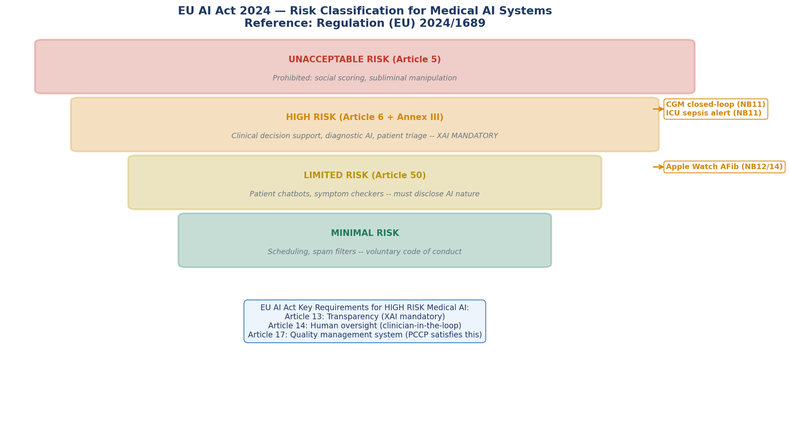<br>
  <em>NB15 — EU AI Act 2024 risk classification pyramid annotated with the course's own models. CGM closed-loop and ICU Sepsis alert systems fall under HIGH RISK (XAI mandatory per Article 13); Apple Watch AFib is LIMITED RISK.</em>
</p>

---

**NB16 — Adversarial Attacks on Medical AI** · [](https://colab.research.google.com/github/utkukose/xai-healthcare-NB-lecture/blob/main/Module_5/NB16_Adversarial_Attacks_Medical_AI.ipynb)

Topics covered:

- **Attack taxonomy for medical AI:** four categories — evasion attacks (modify inputs at inference time), data poisoning (corrupt training data), model stealing (reconstruct model from queries), inference attacks (extract training data from model outputs); why black-box evasion attacks are the most clinically relevant threat
- **Evasion attack subtypes covered:** HopSkipJump (decision-based, query-efficient), ZooAttack (zeroth-order optimisation), and perturbation analysis
- **Attack 1 — CGM Hypoglycaemia Alert Suppression (HopSkipJump):** perturbing CGM glucose readings so the AI fails to predict hypoglycaemia < 70 mg/dL; 14/20 alerts suppressed; clinical scenario: faulty sensor firmware or deliberate manipulation
- **Attack 2 — ICU Sepsis Alert Delay (ZooAttack):** delaying the Sepsis-3 early warning by perturbing bedside monitor readings; 3/15 alerts delayed; clinical impact: each hour of delay increases mortality risk by 7% (Kumar et al. 2006)
- **Attack 3 — Apple Watch AFib Misclassification (HopSkipJump):** suppressing all 15/15 AFib detections in the test set; clinical consequence: patient not referred for anticoagulation
- **Data poisoning — Backdoor Attack on Training Data:** inserting a trigger pattern into training examples; 426/426 backdoor activations post-deployment; the poisoned model achieves normal AUC on clean validation data — undetectable without XAI-based inspection
- **Attack impact visualisation and clinical risk assessment:** cross-attack comparison of suppression rate, risk score delta, perturbation magnitude, and clinical consequence severity
- **Bridge to NB17:** why standard AUC validation cannot detect any of these four attacks — and what role XAI plays in detection

<p align="center">
  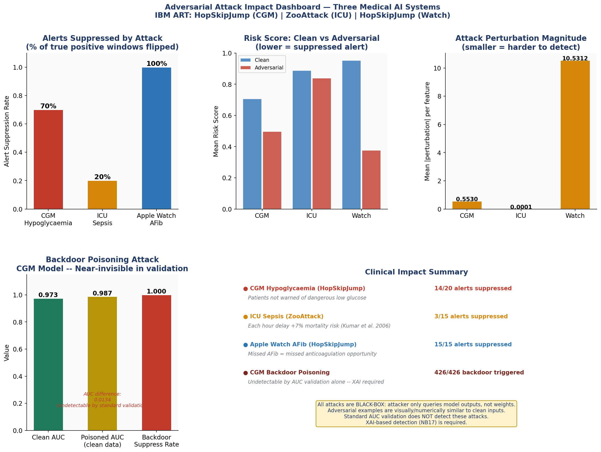<br>
  <em>NB16 — Attack impact dashboard. All attacks are black-box (query-only access). CGM: 14/20 hypoglycaemia alerts suppressed. ICU: 3/15 sepsis warnings delayed. Watch: 15/15 AFib detections suppressed. Backdoor poisoning: 426/426 trigger activations, undetectable by standard AUC validation.</em>
</p>

---

**NB17 — XAI-Based Security & Defence** · [](https://colab.research.google.com/github/utkukose/xai-healthcare-NB-lecture/blob/main/Module_5/NB17_XAI_Security_Defence.ipynb)

Topics covered:

- **SHAP-based adversarial detection — Explanation Anomaly Scoring:** adversarial attacks change predictions by perturbing features in clinically implausible directions; this causes SHAP values to shift in a detectable way; implementing an anomaly score on the SHAP vector; precision/recall of detection across the NB16 attacks
- **GEMEX geodesic length as off-manifold detector:** adversarial examples must cross the decision boundary, which requires moving away from the training data manifold; GEMEX geodesic arc-length is larger for adversarial inputs than for clean inputs; per-instance distance comparison and scatter plot showing clean vs adversarial separation
- **Page-Hinkley test repurposed for sustained attack detection:** mathematically identical to the drift detector in NB13; detecting a sustained adversarial campaign by monitoring the rolling SHAP anomaly score over time
- **Certified robustness analysis:** computing the maximum perturbation radius ε below which the model's prediction is guaranteed not to change; comparing certified radius across the CGM, ICU, and Watch models
- **Unified security report generator:** combining SHAP anomaly scores, GEMEX geodesic distances, and Page-Hinkley results into a single structured security assessment with ranked defence recommendations
- **Module 5 synthesis:** the progression from governance (NB15) to attack (NB16) to defence (NB17); how XAI and security are inseparable for trustworthy medical AI deployment

<p align="center">
  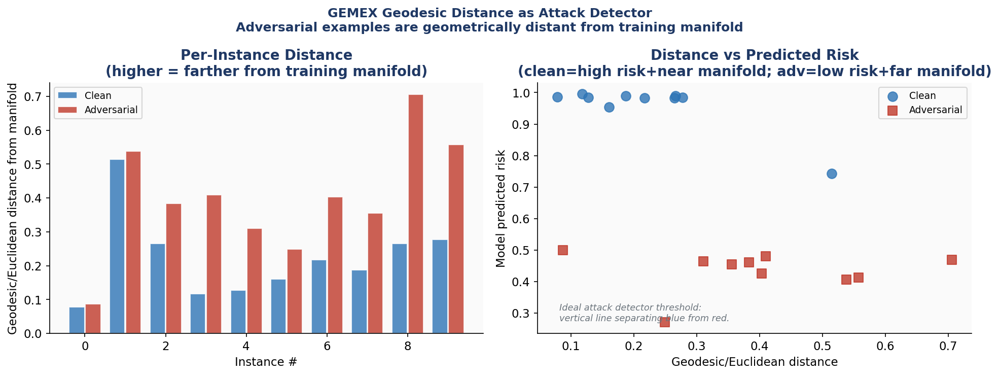<br>
  <em>NB17 — GEMEX geodesic distance as attack detector. Clean inputs (blue) cluster near the training manifold; adversarial inputs (red) are pushed far from it. The scatter plot shows near-perfect separation: clean = high predicted risk + near manifold; adversarial = low predicted risk + far from manifold.</em>
</p>

---

### Module 6 — Application Workshop: Design of an Explainable AI Solution (NB18 – NB23)

> *The capstone module: students apply the complete course toolkit to four genuine clinical problems — adversarial robustness on real chest X-rays, drug repositioning via molecular XAI, leukaemia subtype genomics, and fetal echocardiography — then build and deploy a clinical XAI dashboard integrating everything.*

| Notebook | Title | Open in Colab |
|----------|-------|--------------|
| [NB18](Module_6/NB18_Adversarial_Attacks_PneumoniaMNIST.ipynb) | Adversarial Attacks on PneumoniaMNIST | [](https://colab.research.google.com/github/utkukose/xai-healthcare-NB-lecture/blob/main/Module_6/NB18_Adversarial_Attacks_PneumoniaMNIST.ipynb) |
| [NB19](Module_6/NB19_XAI_Defences_PneumoniaMNIST.ipynb) | XAI Defences on PneumoniaMNIST | [](https://colab.research.google.com/github/utkukose/xai-healthcare-NB-lecture/blob/main/Module_6/NB19_XAI_Defences_PneumoniaMNIST.ipynb) |
| [NB20](Module_6/NB20_Molecular_Property_Prediction_Drug_Repositioning_XAI.ipynb) | Molecular Property Prediction & Drug Repositioning XAI | [](https://colab.research.google.com/github/utkukose/xai-healthcare-NB-lecture/blob/main/Module_6/NB20_Molecular_Property_Prediction_Drug_Repositioning_XAI.ipynb) |
| [NB21](Module_6/NB21_Leukaemia_GeneExpression_XAI.ipynb) | Leukaemia Gene Expression XAI | [](https://colab.research.google.com/github/utkukose/xai-healthcare-NB-lecture/blob/main/Module_6/NB21_Leukaemia_GeneExpression_XAI.ipynb) |
| [NB22](Module_6/NB22_XAI_ToF_Echo.ipynb) | XAI on Fetal Echocardiography | [](https://colab.research.google.com/github/utkukose/xai-healthcare-NB-lecture/blob/main/Module_6/NB22_XAI_ToF_Echo.ipynb) |
| [NB23](Module_6/NB23_Streamlit_Dashboard.ipynb) | Streamlit Clinical XAI Dashboard | [](https://colab.research.google.com/github/utkukose/xai-healthcare-NB-lecture/blob/main/Module_6/NB23_Streamlit_Dashboard.ipynb) |

**NB18 — Adversarial Attacks on PneumoniaMNIST** · [](https://colab.research.google.com/github/utkukose/xai-healthcare-NB-lecture/blob/main/Module_6/NB18_Adversarial_Attacks_PneumoniaMNIST.ipynb)

Topics covered:

- **Clinically realistic attack surface:** PneumoniaMNIST CNN (624 real chest X-rays in the test split) as the target — a more credible threat model than synthetic image classifiers
- **Attack Zoo — seven families implemented:**
  - *FGSM (Fast Gradient Sign Method):* single-step gradient-based; fastest; least transferable
  - *PGD (Projected Gradient Descent):* iterative FGSM; stronger; standard benchmark (Madry et al. 2018)
  - *Carlini-Wagner (C&W):* optimisation-based; finds minimum-perturbation adversarial examples; strongest in terms of distortion budget
  - *DeepFool:* geometric method finding the nearest decision boundary; efficient and interpretable
  - *One-Pixel:* modifying a single pixel; demonstrates that even minimal perturbation can flip medical image classification
  - *Boundary Attack:* decision-based black-box attack; no gradient access required
  - *Surrogate Attack:* training a substitute model to generate transferable adversarial examples
- **Grad-CAM under active attack:** applying Grad-CAM to both clean and adversarial chest X-rays side-by-side; observing how the explanation changes when the prediction is flipped; the clinical safety implication of explanation corruption

---

**NB19 — XAI Defences on PneumoniaMNIST** · [](https://colab.research.google.com/github/utkukose/xai-healthcare-NB-lecture/blob/main/Module_6/NB19_XAI_Defences_PneumoniaMNIST.ipynb)

Topics covered:

- **Self-contained setup:** NB18 pipeline reproduced compactly so NB19 is fully standalone; all seven attacks regenerated
- **GEMEX geodesic XAI as off-manifold detector on images:** computing Fisher-Rao geodesic arc-length on the CNN's penultimate embedding manifold; adversarial chest X-rays have larger geodesic distance from the training data than clean X-rays; detection threshold calibration and AUC of the detector
- **Defence Battery — four mechanisms:**
  - *Adversarial Training:* augmenting the training set with adversarial examples (PGD); the gold standard defence; trade-off between robustness and clean accuracy
  - *Feature Squeezing:* reducing input colour depth and applying spatial smoothing before inference; low computational cost; effective against high-frequency perturbations
  - *Input Preprocessing:* JPEG compression, bit-depth reduction, Gaussian blur as pre-inference filters; removing adversarial noise without retraining
  - *Gradient Masking:* obfuscating gradients to impede white-box attacks; effective against gradient-based methods but not black-box attacks
- **XAI recovery analysis:** the critical clinical deployment question — after applying each defence, does Grad-CAM attention return to clinically correct regions (lungs)? Systematic comparison of Grad-CAM before attack, under attack, and after each defence mechanism

---

**NB20 — Molecular Property Prediction & Drug Repositioning XAI** · [](https://colab.research.google.com/github/utkukose/xai-healthcare-NB-lecture/blob/main/Module_6/NB20_Molecular_Property_Prediction_Drug_Repositioning_XAI.ipynb)

Topics covered:

- **Real molecular datasets:** BBBP (300+ blood-brain barrier permeability compounds, Martins et al. 2012) and ESOL (60 aqueous solubility compounds, Delaney 2004) from curated SMILES literals; full datasets available via direct download
- **Molecular feature engineering:** 1024-bit Morgan (ECFP4) fingerprints computed via RDKit + 4 Lipinski descriptors (MW, LogP, HBD, HBA) = 1028-dimensional feature vector per compound
- **Scaffold-aware cross-validation:** Bemis–Murcko scaffold splitting before train/test partitioning — preventing data leakage in drug ML where similar compounds should not appear in both train and test
- **Molecular SHAP — fingerprint-bit attribution:** TreeSHAP on the GBM classifier; mapping high-attribution fingerprint bits back to their corresponding chemical substructures; reading which molecular fragments drive permeability or solubility predictions
- **CNS drug repositioning screen:** evaluating 20 approved CNS drugs (outside the training set) for BBBP permeability; SHAP explanations showing which structural features of each drug support or oppose predicted permeability; regulatory framing as a hypothesis-generation tool, not a clinical recommendation
- **Governance report:** EU AI Act risk classification for a drug discovery AI tool; data provenance documentation; limitations and confidence intervals

---

**NB21 — Leukaemia Gene Expression XAI** · [](https://colab.research.google.com/github/utkukose/xai-healthcare-NB-lecture/blob/main/Module_6/NB21_Leukaemia_GeneExpression_XAI.ipynb)

Topics covered:

- **Golub et al. 1999 ALL/AML dataset:** 72 patients (47 ALL, 25 AML), 7,129 gene expression features from Affymetrix microarrays; the landmark paper that established that gene expression can distinguish cancer subtypes; Dana-Farber Cancer Institute and MIT Whitehead Institute data
- **Differential expression analysis:** t-statistic ranking of all 7,129 genes between ALL and AML; volcano plot; identifying the top discriminative gene markers and their known biological roles
- **KEGG pathway aggregation:** mapping individual gene SHAP values to biological pathway-level attributions using real KEGG pathway gene sets (PI3K-AKT, JAK-STAT, Apoptosis, and others); pathway-level bar chart of SHAP importance
- **GBM classifier with Leave-One-Out cross-validation:** the correct evaluation strategy for n=72 (no held-out test set possible); per-patient SHAP waterfall showing the gene pathways driving each individual leukaemia subtype classification
- **Counterfactual gene expression profiles:** for each AML patient, computing the minimal biologically-directed pathway change that would flip the classification to ALL; actionable targets for therapeutic intervention hypotheses
- **Haematologist-facing explanation generator:** translating pathway SHAP values into structured natural language reports referencing the biological function of each implicated pathway
- **NB20 ↔ NB21 bridge:** from pathway XAI (which pathways differentiate ALL from AML) to drug repositioning (which approved drugs target those pathways, referencing NB20's CNS screen methodology)

---

**NB22 — XAI on Fetal Echocardiography** · [](https://colab.research.google.com/github/utkukose/xai-healthcare-NB-lecture/blob/main/Module_6/NB22_XAI_ToF_Echo.ipynb)

The most clinically demanding notebook in the series: XAI applied to real fetal cardiac ultrasound video. Topics covered:

- **Real clinical data:** open-access fetal echocardiography recordings of Tetralogy of Fallot (ToF) — the most common cyanotic congenital heart defect; two variants: ToF with pulmonary atresia vs ToF with pulmonary stenosis; frame extraction, dual-panel crop, brightness normalisation, and augmentation pipeline
- **CNN classifier:** lightweight 2D CNN trained on preprocessed echocardiography frames; training on the binary classification task (atresia vs stenosis); per-class accuracy and confusion matrix
- **Grad-CAM per-frame cardiac XAI video:** Grad-CAM applied to every frame in the echocardiography clip; temporal assembly into a video showing which cardiac structures the CNN attends to across the cardiac cycle (systole → diastole → systole); clinical reading of attention location relative to anatomical landmarks
- **LIME superpixel-level cardiac explanation:** SLIC superpixel segmentation of echo frames; LIME identifying which cardiac regions (right ventricular outflow tract, pulmonary valve area, ventricular septum) most influence the classification
- **GEMEX geodesic arc-length across the cardiac cycle:** computing Fisher-Rao geodesic arc-length from each frame's embedding to the baseline; plotting arc-length as a function of time within the cardiac cycle; identifying which cardiac phases carry the most discriminative information for the ToF variant classification
- **Counterfactual explanations at frame level:** for a selected high-stakes frame, computing the minimum pixel-level change that would flip the predicted ToF variant; clinical interpretation of which anatomical features would need to change

---

**NB23 — Streamlit Clinical XAI Dashboard** · [](https://colab.research.google.com/github/utkukose/xai-healthcare-NB-lecture/blob/main/Module_6/NB23_Streamlit_Dashboard.ipynb)

Topics covered:

- **Five core Streamlit patterns explained with clinical examples:** `cache_resource` (loading models once across sessions), `sidebar` (patient selection controls), `tabs` (multi-method XAI layout), `session_state` (persisting patient selections and SHAP computations), `download_button` (exporting explanation reports)
- **Backend verification:** running both dataset backends (Cleveland Heart Disease and Pima Diabetes) and confirming AUC scores match the notebook experiments before building the UI
- **Complete `app_nb23.py`:** a single-file Streamlit application implementing SHAP explanation, LIME explanation, counterfactual generation, patient risk profile, and explanation report download — supporting both datasets and a custom CSV upload pathway
- **Three deployment paths:**
  - *Local:* `streamlit run app_nb23.py` — opens at `http://localhost:8501`
  - *Google Colab:* via pyngrok tunnel — zero local installation
  - *Streamlit Community Cloud:* push `app_nb23.py` + `requirements.txt` to a public GitHub repo; free permanent hosting
- **Course capstone framing:** this dashboard integrates all core XAI methods covered in the course into a deployable clinical decision support interface

---

## 📊 Datasets Used

| Dataset | Notebooks | Source | Notes |
|---------|-----------|--------|-------|
| **Breast Cancer Wisconsin (Diagnostic)** | Module 1 | [UCI ML Repository](https://archive.ics.uci.edu/dataset/17/breast+cancer+wisconsin+diagnostic) | 569 patients, 30 FNA morphometric features |
| **Pima Indians Diabetes** | NB0–NB7 | [UCI ML Repository](https://www.kaggle.com/datasets/uciml/pima-indians-diabetes-database) | 768 patients, 8 features |
| **Cleveland Heart Disease** | NB0–NB9 | [UCI ML Repository](https://archive.ics.uci.edu/dataset/45/heart+disease) | 297 patients, 13 features |
| **PneumoniaMNIST** | NB5, NB9, NB18, NB19 | [MedMNIST v2](https://medmnist.com/) | 5,856 chest X-rays at 64×64, binary classification |
| **Golub ALL/AML** | NB21 | Golub et al., *Science* 1999 | 72 patients, 7,129 genes |
| **BBBP / ESOL** | NB20 | Martins et al. 2012 / Delaney 2004 | Blood-brain barrier permeability & aqueous solubility |
| **Fetal Echocardiography (ToF)** | NB22 | Real clinical recordings | Tetralogy of Fallot variants; full attribution in notebook |

All included data files are either publicly licensed benchmark datasets or fully synthetic. No patient-identifiable information is present in this repository.

---

## 🚀 Quick Start

### Option A — Google Colab (Recommended, no installation)

Click any **Open in Colab** badge above. Run **NB0** first (Module 2) to install all dependencies and download datasets. Subsequent notebooks in the same Colab session reuse the installed packages.

### Option B — Local Setup

```bash
# Clone the repository
git clone https://github.com/utkukose/xai-healthcare-NB-lecture.git
cd xai-healthcare-NB-lecture

# Create a virtual environment (Python 3.9+ required)
python -m venv venv
source venv/bin/activate   # Windows: venv\Scripts\activate

# Install core dependencies
pip install shap lime scikit-learn scikit-image scikit-fuzzy interpret \
            seaborn scipy numpy pandas matplotlib medmnist gemex \
            tensorflow torch torchvision streamlit flask rdkit

# Launch Jupyter
jupyter lab
```

> **Note:** NB22 (fetal echocardiography) additionally requires `opencv-python` and `ffmpeg`. NB14 (Live Apple Watch) requires `flask` and a device on the same local Wi-Fi network.

---

## 🗺 Notebook Dependency Map

```
Module 1 — Foundations of Explainable AI
  └─ dl_clinical_lab  ────────────────────────── standalone (levelling session)

Module 2 — Taxonomy and Evaluation of XAI Methods
  NB0 (datasets + setup)
  ├─ NB1 (glass-box)           Dataset A
  ├─ NB2 (SHAP/PDP)            Datasets A + B
  ├─ NB3 (LIME/MAPLE/IG)       Dataset B
  ├─ NB4 (counterfactuals)     Datasets A + B
  ├─ NB5 (visual XAI)          Dataset C (PneumoniaMNIST)
  ├─ NB6 (GEMEX)               Datasets A + B
  └─ NB7 (eval metrics)        Datasets A + B

Module 3 — AI Architectures for Clinical Data Analysis
  ├─ NB8   builds on NB2/NB3 (tabular architectures)
  ├─ NB9   builds on NB5 (CNN + Grad-CAM)
  └─ NB10  standalone (synthetic ICU time series)

Module 4 — Practical Application of XAI in Medical and IoMT Data
  ├─ NB11  builds on NB8/NB10 (IoMT pipelines)
  ├─ NB12  standalone (Apple Watch AFib)
  ├─ NB13  builds on NB11/NB12 (streaming + drift)
  └─ NB14  extends NB12/NB13 (live hardware)  [BONUS]

Module 5 — Governance, Ethics, and Security in Medical AI Systems
  ├─ NB15  builds on NB11/NB12/NB13 (governance)
  ├─ NB16  builds on NB11/NB12 models (attacks)
  └─ NB17  requires NB16 outputs (defences)

Module 6 — Application Workshop: Design of an Explainable AI Solution
  ├─ NB18  builds on NB5/NB9 (image attacks)
  ├─ NB19  requires NB18 outputs (image defences)
  ├─ NB20  standalone (drug repositioning)
  ├─ NB21  standalone; conceptually links to NB20
  ├─ NB22  standalone (fetal echocardiography)
  └─ NB23  integrates course datasets (Streamlit app)
```

---

## 🛠 Key Tools & Libraries

| Category | Tools |
|----------|-------|
| **XAI — global attribution** | SHAP (TreeSHAP, KernelSHAP, LinearSHAP, DeepSHAP), SAGE, Permutation Importance, PDP, ICE, ALE |
| **XAI — local / instance** | LIME, MAPLE, Integrated Gradients, Anchors, DiCE counterfactuals, Global Surrogate Trees |
| **XAI — visual / imaging** | Grad-CAM, LRP, Vanilla Saliency, SmoothGrad, Occlusion Sensitivity, TCAV |
| **XAI — streaming** | Windowed SHAP, Temporal Grad-CAM, Page-Hinkley drift detection |
| **XAI — geometric manifold** | GEMEX (`pip install gemex`) — geodesic sensitivity fields, holonomy, FAS, BTD |
| **ML / DL frameworks** | scikit-learn, PyTorch, TensorFlow/Keras, XGBoost, LightGBM |
| **Clinical / domain** | MedMNIST, RDKit, `lifelines` (survival analysis), `scikit-fuzzy` |
| **IoMT / wearables** | Flask, Apple HealthKit XML parser, streaming simulator |
| **Visualisation & deployment** | Matplotlib, Seaborn, Plotly, Streamlit |

---

## 📖 Citation

If you use these materials in academic work, teaching, or derivative projects, please cite as:

```bibtex
@misc{kose2026xai_healthcare,
  author       = {K{\"o}se, Utku},
  title        = {Digitalization, AI, and XAI: Strategies for the Transformation
                  of the Healthcare Sector -- Lecture Notebook Series},
  year         = {2026},
  howpublished = {GitHub},
  url          = {https://github.com/utkukose/xai-healthcare-NB-lecture},
  note         = {Graduate course materials, Universidad Panamericana,
                  Faculty of Business, Mexico City, Spring 2026}
}
```

---

## 📄 License

<a rel="license" href="http://creativecommons.org/licenses/by-nc-sa/4.0/"></a>

This work is licensed under a **[Creative Commons Attribution-NonCommercial-ShareAlike 4.0 International (CC BY-NC-SA 4.0)](http://creativecommons.org/licenses/by-nc-sa/4.0/)** licence.

**You are free to:**
- ✅ **Share** — copy and redistribute the material in any medium or format
- ✅ **Adapt** — remix, transform, and build upon the material

**Under the following terms:**
- 📛 **Attribution** — Give appropriate credit, link to the licence, and indicate changes. See [Citation](#-citation) for the preferred format.
- 🚫 **NonCommercial** — You may not use the material for commercial purposes (paid courses, commercial training products) without written permission.
- 🔄 **ShareAlike** — Derivative works must be distributed under the same licence.

> **For commercial licensing enquiries:** contact [utkukose@sdu.edu.tr](mailto:utkukose@sdu.edu.tr)

---

## 🙏 Acknowledgements

**A Special Thank You**

These course materials would not exist in their present form without the generous support of colleagues at Universidad Panamericana. A sincere and warm thank you goes to **Prof. Dr. Román Rodríguez Aguilar** (Faculty of Business Sciences, Universidad Panamericana), who not only supported the development of this course from the outset but personally managed and supervised its general flow throughout the semester. His academic vision, encouragement, and hands-on involvement were invaluable in shaping the course into what it became.

Heartfelt thanks also to **Prof. Dr. Marisol Velázquez Salazar**, Head of Department at the Faculty of Business Sciences, for her trust and institutional support, which created the conditions for a course of this scope and ambition to be offered at the graduate level.

Warm appreciation to all the **faculty members** of the Faculty of Business Sciences for their collegiality and the stimulating academic environment they foster. And above all, sincere thanks to all the **enrolled students** of the Spring 2026 cohort — their curiosity, engagement, and thoughtful questions in every session were the real engine behind these materials. This series was written for you first.

---

**Course Institution**
These materials were developed for and delivered at **Universidad Panamericana, Faculty of Business Sciences**, Mexico City, Spring 2026.

**Datasets**
- Breast Cancer Wisconsin: UCI Machine Learning Repository.
- PneumoniaMNIST: [MedMNIST v2](https://medmnist.com/) (Yang et al., 2023). `pip install medmnist`
- Fetal echocardiography data (NB22): open-access clinical recordings; full attribution within the notebook.
- All other benchmark datasets are publicly licensed and cited at point of use.

**Open-Source Community**
The notebooks build on the excellent ecosystems of scikit-learn, SHAP, LIME, PyTorch, TensorFlow, RDKit, MedMNIST, and Streamlit. Grateful acknowledgement to all contributors to these projects.

---

<div align="center">

**Prof. Dr. Utku Köse**

Süleyman Demirel University · Universidad Panamericana · University of North Dakota · VelTech University

[🌐 utkukose.com](https://utkukose.com) · [GitHub @utkukose](https://github.com/utkukose) · [ORCID 0000-0002-9652-6415](https://orcid.org/0000-0002-9652-6415)

IEEE Senior Member · ACM Professional Member

`utkukose@sdu.edu.tr` · `ukose@up.edu.mx` · `utkukose@gmail.com`

</div>
